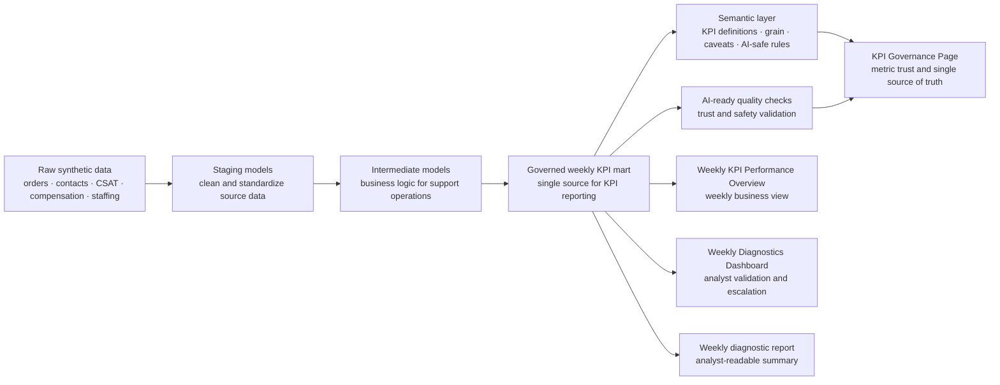

# AI Analytics: Synthetic CS Operations Automation Stack

This is a self-initiated synthetic/mock portfolio project that demonstrates end-to-end analytics automation for a marketplace customer support use case. It starts with raw synthetic operational data and ends with governed KPI reporting, analyst diagnostics, and KPI trust documentation.

No real customer, employee, financial, employer, or proprietary company data is used.

## Business Context

Customer Support leadership needs a reliable weekly business review across countries and contact reasons. The key KPIs are contact volume, contact rate, AHT, FCR, CSAT, backlog, compensation cost, and cancellation rate.

In many operations teams, weekly reporting is slow, manual, and fragmented. Analysts spend too much time preparing data, checking definitions, and explaining metric differences before the business can even start discussing performance. KPI definitions may also become inconsistent across reports, which makes decision-making less reliable.

This project shows how an AI-ready analytics workflow can reduce that friction: one governed semantic KPI layer supports automated business reporting, analyst diagnostics, KPI governance documentation, and future BI implementation.

## Live Dashboards

| View | Purpose | Link |
| --- | --- | --- |
| Weekly KPI Performance Overview | Overall weekly KPI reporting and period-over-period performance view | [Open dashboard](https://yusi0928.github.io/Projects/0.%20Mock%20AI%20Analytics%20Automation%20Project/dashboard/kpi_reporting.html) |
| Weekly Diagnostics Dashboard | Analyst-focused movement detection, validation queue, and escalation view | [Open dashboard](https://yusi0928.github.io/Projects/0.%20Mock%20AI%20Analytics%20Automation%20Project/dashboard/) |
| KPI Governance Page | KPI definitions, lineage, quality checks, caveats, and AI-safe single source of truth | [Open dashboard](https://yusi0928.github.io/Projects/0.%20Mock%20AI%20Analytics%20Automation%20Project/dashboard/kpi_governance.html) |

## Orchestration And Dependencies



## Project Layers

| Layer | What it does | Key artifact |
| --- | --- | --- |
| Raw synthetic data | Creates mock customer support data for a safe portfolio project | [`data/raw/`](data/raw/) |
| Staging | Cleans and standardizes the source data | [`models/staging/`](models/staging/) |
| Intermediate models | Adds business logic for orders, contacts, CSAT, compensation, and staffing | [`models/intermediate/`](models/intermediate/) |
| KPI mart | Creates the weekly KPI table used as the single source for reporting and diagnostics | [`data/marts/mart_weekly_cs_kpi_by_country_reason.csv`](data/marts/mart_weekly_cs_kpi_by_country_reason.csv) |
| Semantic layer | Defines each KPI, its grain, owner, caveats, and AI-safe usage rules | [`models/semantic/semantic_cs_kpi_metrics.yml`](models/semantic/semantic_cs_kpi_metrics.yml) |
| AI-ready quality checks | Checks whether the KPI layer is reliable and safe for AI-assisted analysis | [`docs/data_quality_results.md`](docs/data_quality_results.md) |
| Orchestration | Shows how the workflow runs from data generation to dashboard output | [`orchestration/airflow_dag.py`](orchestration/airflow_dag.py) / [`scripts/`](scripts/) |
| AI data governance | Shows KPI definitions, lineage, quality checks, caveats, and single source of truth | [`dashboard/kpi_governance.html`](dashboard/kpi_governance.html) |
| Business reporting & analyst diagnostics | Shows weekly KPI reporting and diagnostic signals for analysts to validate and escalate | [`dashboard/kpi_reporting.html`](dashboard/kpi_reporting.html) · [`dashboard/index.html`](dashboard/index.html) |

## Portfolio Value

This project demonstrates the ability to turn fragmented operational data into a governed, repeatable analytics workflow. It shows how raw data can be transformed into reliable KPI layers, validated for AI-assisted use, and published into business reporting, analyst diagnostics, and KPI governance views.

## Reproduce Locally

```bash
python3 scripts/generate_synthetic_data.py
python3 scripts/build_sqlite_stack.py
python3 scripts/run_weekly_diagnostics.py
```
