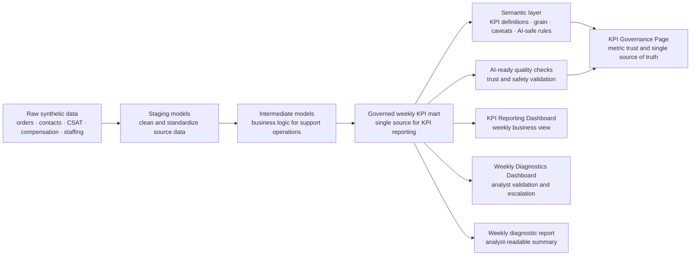

# AI Analytics: Synthetic CS Operations Automation Stack

This is a self-initiated synthetic/mock portfolio project that demonstrates end-to-end analytics automation for a marketplace customer support use case. It starts with raw synthetic operational data and ends with governed KPI reporting, analyst diagnostics, and KPI trust documentation.

No real customer, employee, financial, employer, or proprietary company data is used.

## Business Context

Customer Support leadership needs a weekly business review across countries and contact reasons. The key KPIs are contact volume, contact rate, AHT, FCR, CSAT, backlog, compensation cost, and cancellation rate.

One governed semantic KPI layer supports multiple consumption channels: automated business reporting, analyst diagnostics, KPI governance documentation, and future BI implementation.

## Project Layers

| Layer | What it does | Key artifact |
| --- | --- | --- |
| Raw synthetic data | Creates mock customer support data for a safe portfolio project | [`data/raw/`](data/raw/) |
| Staging | Cleans and standardizes the source data | [`models/staging/`](models/staging/) |
| Intermediate models | Adds business logic for orders, contacts, CSAT, compensation, and staffing | [`models/intermediate/`](models/intermediate/) |
| KPI mart | Creates the weekly KPI table used as the single source for reporting and diagnostics | [`data/marts/mart_weekly_cs_kpi_by_country_reason.csv`](data/marts/mart_weekly_cs_kpi_by_country_reason.csv) |
| Semantic layer | Defines each KPI, its grain, owner, caveats, and AI-safe usage rules | [`models/semantic/semantic_cs_kpi_metrics.yml`](models/semantic/semantic_cs_kpi_metrics.yml) |
| AI-ready quality checks | Checks whether the KPI layer is reliable and safe for AI-assisted analysis | [`docs/data_quality_results.md`](docs/data_quality_results.md) |
| Orchestration | Shows how the workflow runs from data generation to dashboard output | [`orchestration/airflow_dag.py`](orchestration/airflow_dag.py) / [`scripts/`](scripts/) |
| AI data governance | Shows KPI definitions, lineage, quality checks, caveats, and single source of truth | [`dashboard/kpi_governance.html`](dashboard/kpi_governance.html) |
| Business reporting & analyst diagnostics | Shows weekly KPI reporting and diagnostic signals for analysts to validate and escalate | [`dashboard/kpi_reporting.html`](dashboard/kpi_reporting.html) · [`dashboard/index.html`](dashboard/index.html) |

## Orchestration And Dependencies



| Step | What happens | Output |
| --- | --- | --- |
| 1 | Generate synthetic data | Raw CSV inputs |
| 2 | Build SQL layers | Staging, intermediate, and KPI mart |
| 3 | Run quality checks | AI-ready validation results |
| 4 | Run diagnostics | Weekly movement signals and analyst queue |
| 5 | Generate views | KPI reporting, diagnostics, and governance pages |

## Dashboard Versions

- [KPI Reporting Dashboard](dashboard/kpi_reporting.html): standard weekly business view from the governed KPI mart. It answers: how is customer support performance trending?
- [Weekly Diagnostics Dashboard](dashboard/index.html): latest-week movement detection, confidence flags, business impact, and analyst validation queue. It answers: what changed this week, and what should analysts investigate first?
- [KPI Governance Page](dashboard/kpi_governance.html): KPI definitions, ownership, quality status, lineage, caveats, and AI-safe usage policy. It answers: can we trust these KPIs, how are they defined, and can AI safely use them?

Live views:

- KPI Reporting Dashboard: https://yusi0928.github.io/Projects/0.%20Mock%20AI%20Analytics%20Automation%20Project/dashboard/kpi_reporting.html
- Weekly Diagnostics Dashboard: https://yusi0928.github.io/Projects/0.%20Mock%20AI%20Analytics%20Automation%20Project/dashboard/
- KPI Governance Page: https://yusi0928.github.io/Projects/0.%20Mock%20AI%20Analytics%20Automation%20Project/dashboard/kpi_governance.html

## How To Run

This project uses Python standard library and SQLite only.

```bash
python3 scripts/generate_synthetic_data.py
python3 scripts/build_sqlite_stack.py
python3 scripts/run_weekly_diagnostics.py
```

## What This Demonstrates

- End-to-end analytics automation from raw data to reusable business views
- SQL-style transformation layers and a governed KPI mart
- KPI definitions, caveats, ownership, and AI-safe usage rules
- Data quality gates before reporting or AI-assisted analysis
- Orchestration thinking for repeatable weekly refresh
- Analyst-grade diagnostics with confidence, business impact, and validation prompts

## Future Roadmap

Phase 2 - optional future work:

- Prepare Looker Studio build materials, such as dashboard specs, calculated fields, chart mapping, and clean data source files.

Phase 3 - optional future work:

- Manually build a public Looker Studio KPI Reporting Dashboard and add the public link to the GitHub README.

Phase 2 and Phase 3 are optional future roadmap items, not part of the current implementation.
