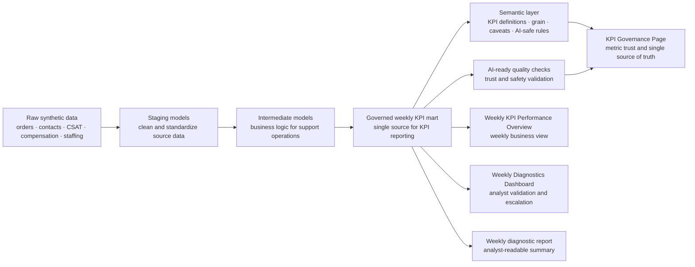

# AI Analytics: Synthetic CS Operations Automation Stack

This is a self-initiated synthetic/mock portfolio project that demonstrates end-to-end analytics automation for a marketplace customer support use case. It starts with raw synthetic operational data and ends with governed KPI reporting, analyst diagnostics, and KPI trust documentation.

No real customer, employee, financial, employer, or proprietary company data is used.

## Business Context

Customer Support leadership needs a reliable weekly business review across countries and contact reasons. The key KPIs are contact volume, contact rate, AHT, FCR, CSAT, backlog, compensation cost, and cancellation rate.

In many operations teams, weekly reporting is slow, manual, and fragmented. Analysts spend too much time preparing data, checking definitions, and explaining metric differences before the business can even start discussing performance. KPI definitions may also become inconsistent across reports, which makes decision-making less reliable.

This project shows how an AI-ready analytics workflow can reduce that friction: one governed semantic KPI layer supports automated business reporting, analyst diagnostics, KPI governance documentation, and future BI implementation.

## Live Dashboards

| View | Purpose | Link |
| --- | --- | --- |
| Weekly KPI Performance Overview | Overall weekly KPI reporting and period-over-period performance view | [Open dashboard](https://yusi0928.github.io/Projects/0.%20Mock%20AI%20Analytics%20Automation%20Project/dashboard/kpi_reporting.html) |
| Weekly Diagnostics Dashboard | Analyst-focused movement detection, validation queue, and escalation view | [Open dashboard](https://yusi0928.github.io/Projects/0.%20Mock%20AI%20Analytics%20Automation%20Project/dashboard/) |
| KPI Governance Page | KPI definitions, lineage, quality checks, caveats, and AI-safe single source of truth | [Open dashboard](https://yusi0928.github.io/Projects/0.%20Mock%20AI%20Analytics%20Automation%20Project/dashboard/kpi_governance.html) |

## Orchestration And Dependencies



## Project Layers

The project is organized as a business-facing analytics stack: a trusted data foundation, a governed KPI layer, repeatable automation, and consumption views for reporting, diagnostics, and metric trust.

| Category | Layer | What it does | Key artifact |
| --- | --- | --- | --- |
| Data foundation | Raw synthetic data | Creates safe mock customer support data for the portfolio case | [`data/raw/`](data/raw/) |
| Data foundation | Staging | Cleans and standardizes source data before business logic is applied | [`models/staging/`](models/staging/) |
| Data foundation | Intermediate models | Adds support operations logic for orders, contacts, CSAT, compensation, and staffing | [`models/intermediate/`](models/intermediate/) |
| Governance & trust | Governed KPI mart | Creates the weekly KPI table used as the single source for reporting and diagnostics | [`data/marts/mart_weekly_cs_kpi_by_country_reason.csv`](data/marts/mart_weekly_cs_kpi_by_country_reason.csv) |
| Governance & trust | Semantic KPI layer | Defines each KPI, grain, owner, caveats, and AI-safe usage rules | [`models/semantic/semantic_cs_kpi_metrics.yml`](models/semantic/semantic_cs_kpi_metrics.yml) |
| Governance & trust | AI-ready quality checks | Tests whether the KPI layer is reliable enough for reporting and AI-assisted analysis | [`docs/data_quality_results.md`](docs/data_quality_results.md) |
| Automation | Orchestration | Shows the repeatable workflow from synthetic data generation to dashboard output | [`orchestration/airflow_dag.py`](orchestration/airflow_dag.py) / [`scripts/`](scripts/) |
| Data consumption | Weekly KPI Performance Overview | Summarizes weekly KPI health, period-over-period movement, and country/reason performance | [Open dashboard](https://yusi0928.github.io/Projects/0.%20Mock%20AI%20Analytics%20Automation%20Project/dashboard/kpi_reporting.html) |
| Data consumption | Weekly Diagnostics Dashboard | Prioritizes metric movements for analyst validation, owner review, and escalation | [Open dashboard](https://yusi0928.github.io/Projects/0.%20Mock%20AI%20Analytics%20Automation%20Project/dashboard/) |
| Data consumption | KPI Governance Page | Documents KPI definitions, lineage, quality checks, caveats, and single source of truth | [Open dashboard](https://yusi0928.github.io/Projects/0.%20Mock%20AI%20Analytics%20Automation%20Project/dashboard/kpi_governance.html) |

## Portfolio Value

This project demonstrates the ability to turn fragmented operational data into a governed, repeatable analytics workflow. It shows how raw data can be transformed into reliable KPI layers, validated for AI-assisted use, and published into business reporting, analyst diagnostics, and KPI governance views.

## Potential Enterprise Extensions

This portfolio version uses static dashboards so the work is easy to review publicly. In an enterprise environment, the same governed KPI layer could support managed BI dashboards in Tableau, Looker, or Looker Studio, with role-based access, scheduled refresh, and stakeholder subscriptions.

The semantic KPI layer and quality checks also create a foundation for AI-assisted stakeholder updates, such as weekly business review drafts, anomaly explanations, and metric Q&A that reference trusted definitions instead of ad hoc calculations.

## Reproduce Locally

```bash
python3 scripts/generate_synthetic_data.py
python3 scripts/build_sqlite_stack.py
python3 scripts/run_weekly_diagnostics.py
```
