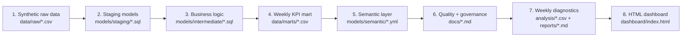

# Mock AI Analytics Automation Project: Synthetic CS Operations Pipeline

This is a self-initiated mock analytics project that simulates a marketplace customer support operations environment. It demonstrates how an analyst can build an end-to-end analytics automation workflow from synthetic raw data to governed KPI marts, semantic definitions, weekly diagnostics, and a reproducible HTML dashboard.

## Data Disclaimer

This is a mock portfolio project built with fully synthetic data. It does not contain real customer, company, employee, operational, financial, or proprietary data from any current or former employer. The project is designed solely to demonstrate analytics automation skills, including data preparation, SQL transformation, semantic KPI design, orchestration thinking, data quality checks, diagnostics, and dashboard generation.

## Business Scenario

Customer Support leadership needs a weekly business review across countries and contact reasons. The sample KPI set includes contact volume, AHT, FCR, CSAT, backlog, compensation cost, cancellation rate, and contact rate.

## Step-By-Step Pipeline



## Evidence By Step

| Step | What it shows | Files |
| --- | --- | --- |
| Synthetic raw data | Mock operational inputs for orders, contacts, CSAT, compensation, and agent activity | [`data/raw/`](data/raw/) |
| Staging models | SQL cleaning and standardization layer | [`models/staging/`](models/staging/) |
| Intermediate logic | Business rules for resolution, fulfillment, compensation, CSAT, and staffing | [`models/intermediate/`](models/intermediate/) |
| KPI mart | Weekly country/contact-reason KPI output | [`data/marts/mart_weekly_cs_kpi_by_country_reason.csv`](data/marts/mart_weekly_cs_kpi_by_country_reason.csv) |
| Semantic layer | Metric definitions and AI-safe analytical layer | [`models/semantic/semantic_cs_kpi_metrics.yml`](models/semantic/semantic_cs_kpi_metrics.yml) |
| Orchestration | Airflow-style task dependency and refresh design | [`orchestration/airflow_dag.py`](orchestration/airflow_dag.py) |
| Quality and governance | Data quality checks, privacy controls, lineage, operating model | [`docs/data_quality_results.md`](docs/data_quality_results.md), [`docs/privacy_controls.md`](docs/privacy_controls.md), [`docs/data_lineage.md`](docs/data_lineage.md) |
| Weekly diagnostics | Latest week vs four-week baseline, anomaly ranking, analyst hypotheses | [`analysis/weekly_kpi_diagnostics.csv`](analysis/weekly_kpi_diagnostics.csv), [`reports/weekly_diagnostics_summary.md`](reports/weekly_diagnostics_summary.md) |
| Final dashboard | Static HTML dashboard with KPI cards, trends, anomaly chart, and analyst queue | [`dashboard/index.html`](dashboard/index.html) |

## How To Run

This project uses Python standard library and SQLite only.

```bash
python3 scripts/generate_synthetic_data.py
python3 scripts/build_sqlite_stack.py
python3 scripts/run_weekly_diagnostics.py
```

Generated outputs:

- `data/marts/mart_weekly_cs_kpi_by_country_reason.csv`
- `docs/data_quality_results.md`
- `analysis/weekly_kpi_diagnostics.csv`
- `analysis/weekly_kpi_summary.json`
- `reports/weekly_diagnostics_summary.md`
- `dashboard/index.html`

The SQLite database is generated locally under `build/` and is intentionally not committed.

## What This Demonstrates

- Data automation from raw synthetic files to analytical outputs
- SQL-based analytics engineering with staging, intermediate, and mart layers
- KPI definition and semantic layer thinking
- Data quality gates before downstream analytics or AI summaries
- Privacy and AI-safe aggregation controls
- Orchestration and rolling reprocessing design
- Weekly KPI diagnostics and analyst validation prompts
- Reproducible HTML dashboard generation
