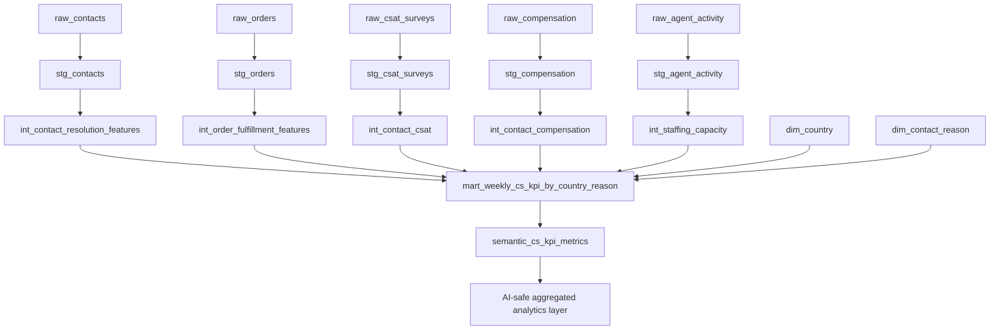

# Data Lineage And Pipeline Dependencies

```mermaid
flowchart TD
    raw_orders[raw_orders] --> stg_orders[stg_orders]
    raw_contacts[raw_contacts] --> stg_contacts[stg_contacts]
    raw_csat[raw_csat_surveys] --> stg_csat[stg_csat_surveys]
    raw_comp[raw_compensation] --> stg_comp[stg_compensation]
    raw_agent[raw_agent_activity] --> stg_agent[stg_agent_activity]

    stg_contacts --> int_contact[int_contact_resolution_features]
    stg_orders --> int_order[int_order_fulfillment_features]
    stg_csat --> int_csat[int_contact_csat]
    stg_comp --> int_comp[int_contact_compensation]
    stg_agent --> int_staff[int_staffing_capacity]

    int_contact --> mart[mart_weekly_cs_kpi_by_country_reason]
    int_order --> mart
    int_csat --> mart
    int_comp --> mart
    int_staff --> mart
    dim_country[dim_country] --> mart
    dim_reason[dim_contact_reason] --> mart

    mart --> semantic[semantic_cs_kpi_metrics]
    semantic --> ai_safe[AI-safe aggregated analytics layer]
```

The AI or reporting layer must run only after the mart and quality checks pass.
