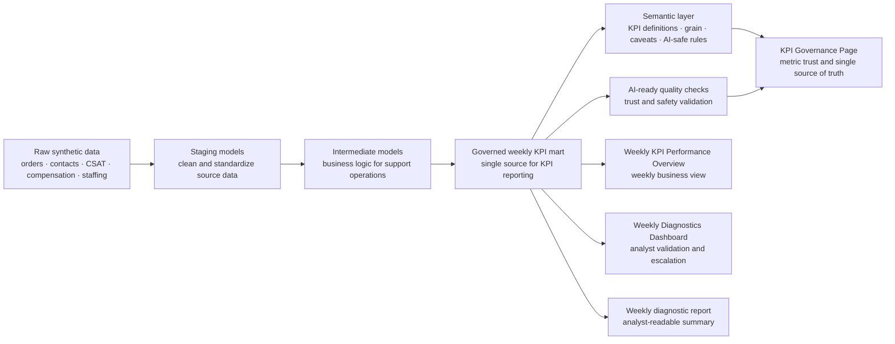

# AI Analytics: Synthetic CS Operations Automation Stack

This is a self-initiated synthetic/mock portfolio project that demonstrates end-to-end analytics automation for a marketplace customer support use case. It starts with raw synthetic operational data and ends with governed KPI reporting, analyst diagnostics, and KPI trust documentation.

No real customer, employee, financial, employer, or proprietary company data is used.

## 30-Second Summary

Customer Support leadership needs a reliable weekly business review across countries and contact reasons. Key KPIs include contact volume, contact rate, AHT, FCR, CSAT, backlog, compensation cost, and cancellation rate.

In many operations teams, this reporting process is still slow, manual, and fragmented. Analysts spend too much time preparing data, reconciling KPI definitions, checking data quality, and explaining metric differences before business teams can focus on performance and decisions.

This project uses synthetic Customer Support data as an example to show how an analytics workflow can be automated and governed end to end:

- generate safe synthetic operational data
- transform raw data into clean analytical layers
- build a governed weekly KPI mart
- define KPI logic through a semantic metric layer
- run data quality checks before metrics are used
- publish BI-style dashboards for weekly performance review
- surface diagnostic insights for anomaly review and escalation
- create an AI-ready foundation for business summaries and stakeholder updates

The goal is not just to build dashboards. The goal is to show how one governed semantic KPI layer can support automated reporting, analyst diagnostics, KPI trust documentation, and future AI-assisted insight workflows.

## Live Dashboards

| View | Purpose | Link |
| --- | --- | --- |
| Weekly KPI Performance Overview | Overall weekly KPI reporting and period-over-period performance view | [Open dashboard](https://yusi0928.github.io/Projects/ai-assisted-analytics-automation/dashboard/kpi_reporting.html) |
| Weekly Diagnostics Dashboard | Analyst-focused movement detection, validation queue, and escalation view | [Open dashboard](https://yusi0928.github.io/Projects/ai-assisted-analytics-automation/dashboard/) |
| KPI Governance Page | KPI definitions, lineage, quality checks, caveats, and AI-safe single source of truth | [Open dashboard](https://yusi0928.github.io/Projects/ai-assisted-analytics-automation/dashboard/kpi_governance.html) |

## Orchestration & Dependencies



## Project Layers

The project is organized as a business-facing analytics stack: a trusted data foundation, a governed KPI layer, repeatable automation, and consumption views for reporting, diagnostics, and metric trust.

| Category | Layer | What it does | Key artifact |
| --- | --- | --- | --- |
| Data foundation | Raw synthetic data | Creates safe mock customer support data for the portfolio case | [`data/raw/`](data/raw/) |
| Data foundation | Staging | Cleans and standardizes source data before business logic is applied | [`models/staging/`](models/staging/) |
| Data foundation | Intermediate models | Adds support operations logic for orders, contacts, CSAT, compensation, and staffing | [`models/intermediate/`](models/intermediate/) |
| Governance & trust | Governed KPI mart | Creates the weekly KPI table used as the single source for reporting and diagnostics | [`data/marts/mart_weekly_cs_kpi_by_country_reason.csv`](data/marts/mart_weekly_cs_kpi_by_country_reason.csv) |
| Governance & trust | Semantic KPI layer | Defines each KPI, grain, owner, caveats, and AI-safe usage rules | [`models/semantic/semantic_cs_kpi_metrics.yml`](models/semantic/semantic_cs_kpi_metrics.yml) |
| Governance & trust | AI-ready quality checks | Tests whether the KPI layer is reliable enough for reporting and AI-assisted analysis | [`docs/data_quality_results.md`](docs/data_quality_results.md) |
| Automation | Orchestration | Shows the repeatable workflow from synthetic data generation to dashboard output | [`orchestration/airflow_dag.py`](orchestration/airflow_dag.py) / [`scripts/`](scripts/) |
| Data consumption | Weekly KPI Performance Overview | Summarizes weekly KPI health, period-over-period movement, and country/reason performance | [Open dashboard](https://yusi0928.github.io/Projects/ai-assisted-analytics-automation/dashboard/kpi_reporting.html) |
| Data consumption | Weekly Diagnostics Dashboard | Prioritizes metric movements for analyst validation, owner review, and escalation | [Open dashboard](https://yusi0928.github.io/Projects/ai-assisted-analytics-automation/dashboard/) |
| Data consumption | KPI Governance Page | Documents KPI definitions, lineage, quality checks, caveats, and single source of truth | [Open dashboard](https://yusi0928.github.io/Projects/ai-assisted-analytics-automation/dashboard/kpi_governance.html) |

## Potential Enterprise Extensions

This portfolio version uses static HTML dashboards so the work is easy to review publicly. In an enterprise environment, the same governed KPI layer could support:

- managed BI dashboards in Tableau, Looker, or Looker Studio
- scheduled refresh, stakeholder subscriptions, and KPI movement alerts
- role-based access by country, function, or leadership level
- weekly business reviews, country check-ins, and contact reason deep dives

The same foundation could also support AI-assisted analytics, with a clear separation between automation and human accountability:

| Step | Responsibility |
| --- | --- |
| AI-assisted drafting | Generate first-pass weekly summaries, anomaly explanations, metric Q&A, and stakeholder update drafts based on trusted KPI definitions and validated outputs |
| Analyst validation | Review data quality, confirm metric movements, add business context, and check whether AI-generated explanations are supported by evidence |
| Human publication | Finalise stakeholder communication, business recommendations, and escalation messages before they are shared with decision-makers |

This keeps AI useful but controlled: AI accelerates reporting and diagnostics, while analysts remain accountable for validation, context, and final business communication.

## Reproduce Locally

```bash
python3 scripts/generate_synthetic_data.py
python3 scripts/build_sqlite_stack.py
python3 scripts/run_weekly_diagnostics.py
```
